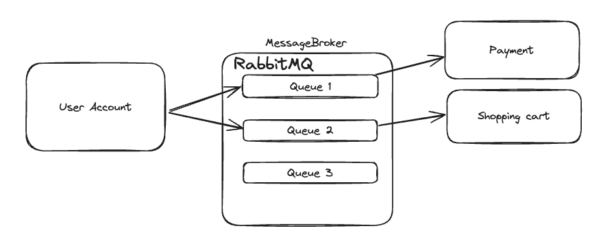

The primary benefit of using a microservices architecture is to solve the issue of availability. When built correctly, a system using microservies will be very loosely coupled. This means they are developed independently and can live, build and deploy independently from one another. This can solve many issues that arise when using a traditional monolithic architecture.

## Monoliths vs Microservices
Monoliths are a more traditional way of creating applications where all code lives in one big repo and gets built into one final product. Everything is coupled together and normally requires one tech stack to be used for every new feature. This means developers have to careful they don't break other things when changing aspects of the system and also everything must be redeployed every time a new change is required. If any part of the system goes down it may impact everything else as a result of the tight coupling. Dependencies may become an issue and eventually different parts can become incredibly tangled.
[1]

This is why some people decide to take the approach of using a microservices architecture. Although there is always a tradeoff and we must understand the pros and cons of each. Fundamentally microservices solves the problem of availability which can plague monoliths but will reduce immediate consistency due to added complexity of so many moving parts.

## Microservices Design
Generally microservices will exist as a series of independent codebases that communicate via a set of API's. How the communication works is crucial and not trivial - if done incorrectly you can end up with a distributed monolith, giving you the worst of both of both worlds. 
#### Synchronous Communication

[1]

The first method uses synchronous communication between services with services sending HTTP requests and waiting for responses. This is simple but has potential performance issues if systems go down. 

#### Asynchronous Communication
[1]
The second method is to use asynchronous communication where messages get sent to an message broker like RabbitMQ which manages the requests and responses from the respective services. This works very well but there are many issues to be aware of. It needs to be resilient to services going down without creating back pressure. Ensuring message ordering is correct can be a challenge as well as scalability of performance.
#### Service Mesh
The other way you can link microservices together is by using a service mesh. This creates a series of proxies sitting beside your services which manage communications in and out of their given partner. This will generally follow the principle of synchronous communication but decouples the service from the communication by having the proxy deal with everything and pass things through when required. Service meshes are designed to give more control over the system and greater surveillance. A well known example of a service mesh is ISTIO which has many desirable features that improve the management of all microservices. The real power from service meshes comes from debugging and logging. Microservices add significant complexity and being able to unpick errors and potential bugs simply is extremely powerful.
[1]
1.  Service mesh allow for mTLS between all systems extremely easily
2. They allow for load balancing so we can split traffic/comms simply
3. It also allows to add retry and circuit breaker policies
4. It can enforce communication blocks - so in the diagram above we could enforce that the UI component can't talk to inventory

## Distributed Monoliths 

Distributed monoliths are what occur when teams fail to properly implement a microservices architecture and end up with systems that aren't sufficiently decoupled from one another to feel the benefits from microservices in the first place. They are not something people set out to make but happen fairly often in business due to poor planning.  

[1]

This graph illustrates how systems can be implemented with logical coupling on the x-axis and physical coupling on the y-axis. The physical distribution represents the ideas explained above;  separate services that require some form of communication layer to create a functioning system as a whole. The logical coupling, which ranges from monolithic to modular represents the extent to which your code or systems are reliant on other parts of your system. It is possible to build a monolithic application that is very modular so when you change parts of your code base it will not start causing bugs elsewhere. It is still a monolith because all the code is housed together under one stack as one artefact, but it is very robust. 

In the diagram we can see the ball of mud adjacent to the modular monolith, hilariously named due to the fact that the application is so tangled and logically coupled that tweaking issues in one part of the system can cause ripple effects everywhere making the developers lives a nightmare. Areas that deals with payment may have become coupled to account signup due to sharing of resources/code or any other reason.

One might imagine a company who finds themselves with a ball of mud monolith deciding to migrate to a microservices architecture to save their developers all this pain. Which leads us on to the idea of a distributed monolith - the worst of both worlds. A system where we have loose physical coupling with many different systems all requiring API endpoints or proxy wrappers but still with all that logical coupling associated with a ball of mud monolith. This could be achieved in a number of different ways. 
1. By continuing to share a database. Unless you have everything separate, this will still cause performance issues and create single points of failure for all systems
2. Not properly adhering to the communication schema. It is common for developers to bypass the mesh/message broker as a 'simple exception' as quick fix and then before you know it you have systems that are connected in many ways you hadn't originally planned creating many more couplings thereby creating portals for errors to leak.
3. logging and surveilling improperly. As mentioned in the service mesh section, logging is important when creating a system of microservices but if you create a system that sits on all applications it can lock you into a certain tech stack and also create a single point of failure if you have centralised logging.

##### References
1. TrailHead - <em>www.github.com/jonathantower/distributed-monolith/blob/main/slides.pdf- date accessed 23/11/23</em>
